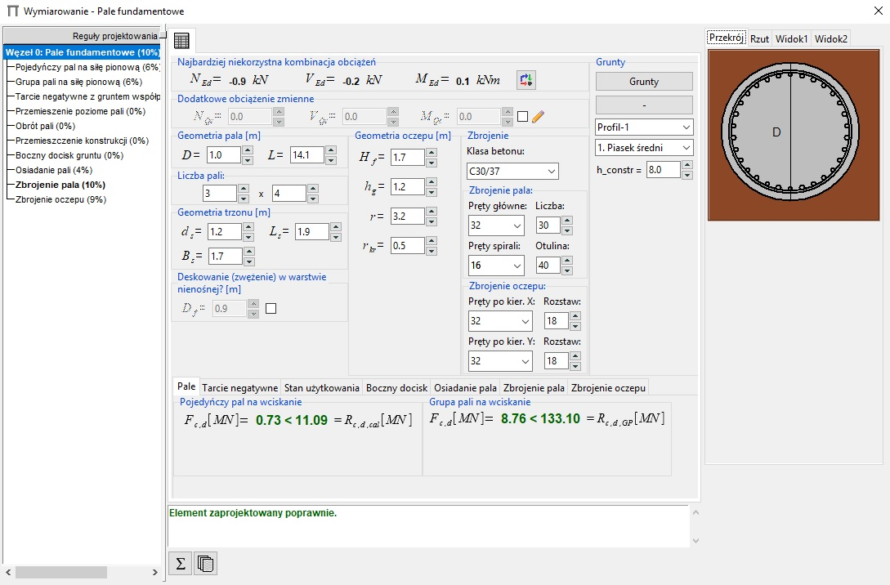
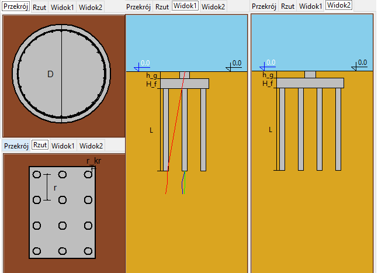

# FoundationPiles-masterThesis
Foundation piles designing plugin to SOLDIS PROJEKTANT software (Topic of our master thesis in Civil Engineering Faculty at Poznań University of Technology).

## Getting started
Whole project was written in Python 2.7.
Unfortunetly this plugin cannot be run standalone, so I put here some pictures of it. There's the whole paper attached, where all algorithm are explained.

User interface

Other piles viewes

## Authors
Jakub Majchrzak
Piotr Piekielny

## Supervisor
PhD Krzysztof Szajek

## Contributions
template of SOLDIS PROJEKTANT plugin - PhD Krzysztof Szajek
user interface - Tkinter library
